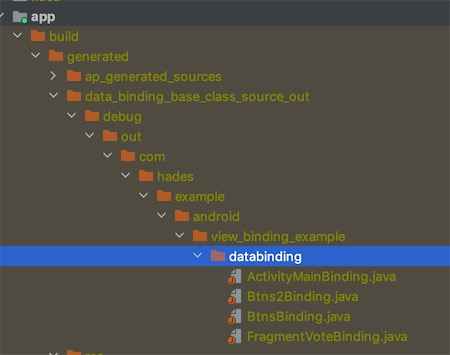

# View-Binding-Example

Use View Binding to replace findViewById or ButterKnife.

# 1 Requirement

Android Studio 3.6 and later.  
Android Gradle Plugin 3.6 and later.

# 2 Configure

Available in Android Gradle Plugin 3.6, not need library.

```groovy
// // Android Gradle Plugin 3.6
android{
  viewBinding {
      enable true
  }
}
```

```groovy
// Android Gradle Plugin 4.0
android{
    buildFeatures {
        viewBinding true
    }
}
```

# 3 Usage

- If view has id, it will in Biding java file.

## Use ViewBinding in Activity

MainActivity.java

```java
 @Override
    protected void onCreate(Bundle savedInstanceState) {
        super.onCreate(savedInstanceState);
//        setContentView(R.layout.activity_main);
        binding = ActivityMainBinding.inflate(getLayoutInflater());
        View rootView = binding.getRoot();
        setContentView(rootView);
    }
```

## Use ViewBinding in Fragment

VoteFragment.java

```java
 @Nullable
    @Override
    public View onCreateView(@NonNull LayoutInflater inflater, @Nullable ViewGroup container, @Nullable Bundle savedInstanceState) {
        // Way 1 : inflate() : pass the layout to be inflated
       binding = FragmentVoteBinding.inflate(inflater,container,false);
       binding.voteJerry.setOnClickListener(view -> clickVoteJerry());
       View rootView = binding.getRoot();
        return rootView;
    }
```

```java
 @Nullable
    @Override
    public View onCreateView(@NonNull LayoutInflater inflater, @Nullable ViewGroup container, @Nullable Bundle savedInstanceState) {
        // Way 2 : inflate(): pass the layout that has already been inflated
        View rootView = inflater.inflate(R.layout.fragment_vote, container, false);
        binding = FragmentVoteBinding.bind(rootView);
        binding.voteJerry.setOnClickListener(view -> clickVoteJerry());
        return rootView;
    }
```

## Use View Binding in Include

MainActivity.java

```xml
<!-- activity_main.xml -->
<include
    android:id="@+id/includes"
    layout="@layout/included_layout" />
```

```xml
<!-- included_layout.xml -->
<?xml version="1.0" encoding="utf-8"?>
<LinearLayout xmlns:android="http://schemas.android.com/apk/res/android"
    android:layout_width="match_parent"
    android:layout_height="wrap_content"
    android:orientation="vertical">

    <Button
        android:id="@+id/greenBtn"
        android:layout_width="wrap_content"
        android:layout_height="wrap_content"
        android:backgroundTint="#00ff00" />
</LinearLayout>
```

```java
// MainActivity.java
// Include
binding.includes.greenBtn.setOnClickListener(view -> clickGreenBtn());
```

## Use View Binding in Merge ?

How to View Binding in below merge code?

```xml
<!-- activity_main.xml -->
<include-->
<!--  layout="@layout/merged_layout" />-->
```

```xml
<!-- merged_layout.xml -->
<?xml version="1.0" encoding="utf-8"?>
<merge xmlns:android="http://schemas.android.com/apk/res/android"
    android:id="@+id/included_btns_2"
    android:layout_width="match_parent"
    android:layout_height="match_parent"
    android:orientation="vertical">

    <Button
        android:id="@+id/blueBtn"
        android:layout_width="wrap_content"
        android:layout_height="wrap_content"
        android:backgroundTint="#0000ff" />
</merge>
```

Way 1 : Recommended

```xml
<!-- activity_main.xml -->
 <include
        android:id="@+id/merge_1"
        layout="@layout/merged_layout_1" />
```

```xml
<!-- merged_layout_1.xml -->
<?xml version="1.0" encoding="utf-8"?>
<Button
    xmlns:android="http://schemas.android.com/apk/res/android"
    android:id="@+id/blueBtn"
    android:layout_width="wrap_content"
    android:layout_height="wrap_content"
    android:backgroundTint="#0000ff" />
```

```java
// MainActivity.java
binding.merge1.blueBtn.setOnClickListener(view -> clickBlueBtn());
```

Way 2 : Depressed

```xml
<!-- activity_main.xml -->
<include
    layout="@layout/merged_layout_2" />
```

```xml
<!-- merged_layout_2.xml -->
<?xml version="1.0" encoding="utf-8"?>
<merge xmlns:android="http://schemas.android.com/apk/res/android"
    android:layout_width="match_parent"
    android:layout_height="match_parent"
    android:orientation="vertical">

    <Button
        android:id="@+id/pinkBtn"
        android:layout_width="wrap_content"
        android:layout_height="wrap_content"
        android:backgroundTint="#ff00ff" />
</merge>
```

```java
// MainActivity.java
private ActivityMainBinding binding;
private MergedLayout2Binding mergedLayout2Binding;

mergedLayout2Binding = mergedLayout2Binding.bind(rootView);
mergedLayout2Binding.pinkBtn.setOnClickListener(view -> clickPinkBtn());
```

## Q : Data Binding vs View Binding?

A :

View Binding is a subset of Data Binding.

## Q : I want a layout file to be ignored while generating binding classes?

A :

```xml
<LinearLayout
        ...
        tools:viewBindingIgnore="true" >
    ...
</LinearLayout>
```

# 4 How does View Binding Work?

  
activity_main.xml -> ActivityMainBinding.java

TBD

Refs:

- https://developer.android.google.cn/topic/libraries/view-binding
- https://medium.com/androiddevelopers/use-view-binding-to-replace-findviewbyid-c8394271fc
